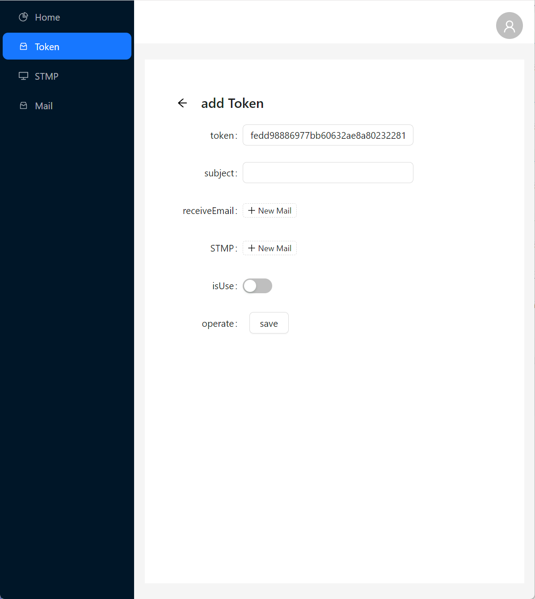

**English**🌎 | [简体中文🀄](./README_zh.md)

In the project, emails are often used to notify abnormal logs, but this requires configuring STMP in the project, as well as the email address that needs to receive emails. However, when the email address changes, it is necessary to modify the project's configuration file. Or due to network restrictions, STMP cannot be configured.

This project uses an HTTP interface as an alternative to STMP. It only needs to configure the STMP and the email address that needs to receive emails within this project to achieve email sending.

Supports GET and POST requests.

Example of GET request:

```powershell
curl 'http://127.0.0.1:12566/sendMail?token=99eaf30feb23e28057367431d820cf319915792921d9cf21b5f761fb75433225&content=this%20is%20a%20test'
```

Example of POST request:

```powershell
curl 'http://127.0.0.1:12566/sendMail' \
--header 'Content-Type: application/x-www-form-urlencoded' \
--data-urlencode 'token=99eaf30feb23e28057367431d820cf319915792921d9cf21b5f761fb75433225' \
--data-urlencode 'content=this is a test'
```

Sending an email with attachments:

```powershell
curl 'http://127.0.0.1:12566/sendMail' \
--form 'files=@"/111111.txt"' \
--form 'files=@"/22222222222222.txt"' \
--form 'token="d6a1ee40c5bad981461643f5404a305a2e3f480cc6fcf65ba98efb63ce32d471"' \
--form 'content="1212"'
```

In fact, it is a simple form submission, so different languages and platforms can make good use of this project.

Parameter description:

- token: Obtained by manually adding in the management interface, the token is a unique value, bound with STMP and the email address to be received.
- content: Email content.
- subject: Email subject. When a token is generated, a subject is also set. When the parameter is empty, the subject set at the time of token generation will be used.
- files: The file that needs to be sent, support for multiple files.

Usage method:

You can directly download the compiled version from the following link:

[Download from GitHub](https://github.com/chuccp/d-mail/releases)

Attention: When downloading the Windows version using Chrome, a virus warning may be triggered, but in fact, there is no virus present. I am unsure how to adjust the settings to avoid such false reports.

After decompression, you can run it directly. The default port number is 12566. A configuration file will be generated, and you can modify the port number in the configuration file. After modification, restart to use the modified port number.

After starting, you can access the management system by opening the browser and entering the IP: 12566.
For example: http://127.0.0.1:12566

System configuration:

When entering the management system for the first time, you need to configure the database and the background management account. The database currently supports sqlite and mysql.


Add STMP address


Add the email address to receive emails


Add Token



After adding, you can send messages to the mailbox through the token.

Configuration file description:

After the program runs, it will automatically generate a configuration file.

```
[core]
init      = true   Whether initialization is complete, default is false, it will become true after the database and account configuration is completed
cachePath = .cache   Temporary cache path when sending email files
dbType    = sqlite  Database type, currently supports sqlite and mysql

[sqlite]
filename = d-mail.db  SQLite file path

[manage]
port     = 12566      Backend management port number
username = 111111     Backend management account
password = 111111     Backend management password
webPath  = web        Static file path

[api]
port = 12566       Port number for sending emails, which is also the port number used by sendMail. If you do not want to share the management account with the management platform, you can set another port number

[mysql]
host     = 127.0.0.1  MySQL host address
port     = 3306       MySQL port number
dbname   = d_mail     MySQL database name, if configured as mysql, you need to create the database in advance
charset  = utf8       Encoding format, default is utf8
username = root       MySQL account
password = 123456     MySQL password
```
