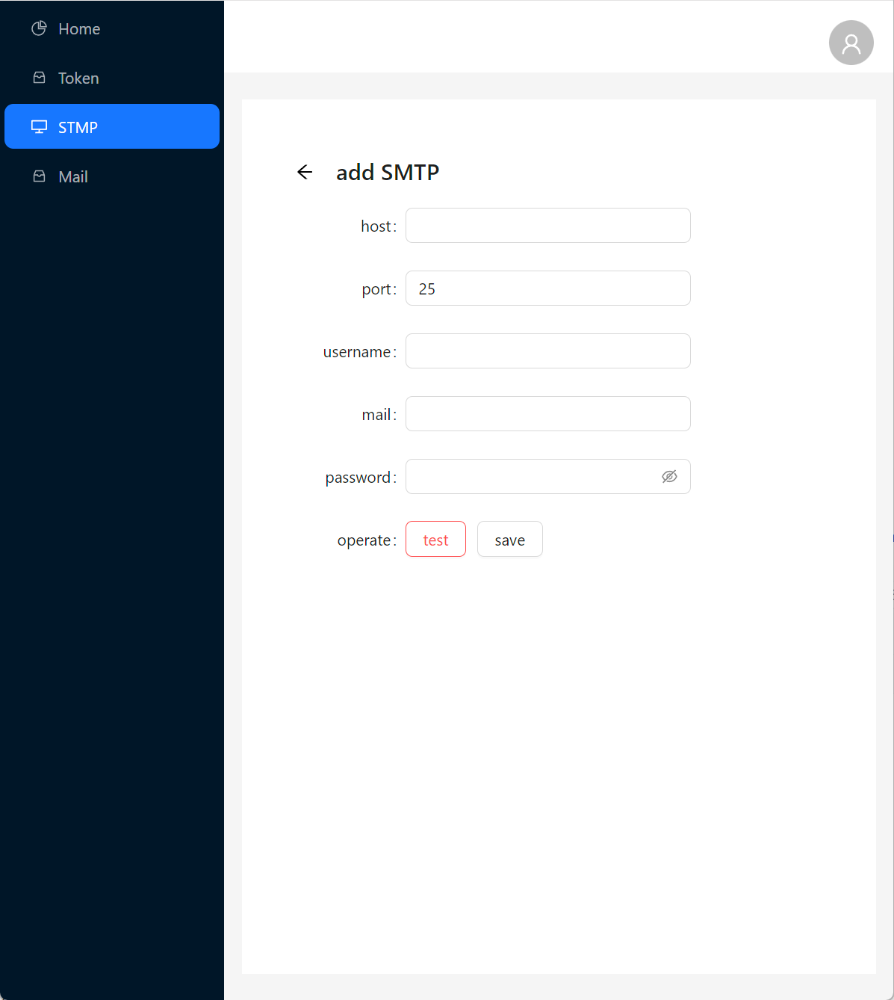

[English🌎](./README.md) | **简体中文🀄**

在项目中，经常由用到邮件来通知异常日志，但这需要在项目中配置STMP，以及需要接收邮件的邮箱，但是当邮件地址发生变更的时候，就需要修改项目的配置文件。或者由于网络限制导致STMP无法配置。

本项目则是使用http接口的替代STMP，只需要在本项目中配置好STMP以及需要接收邮件的电子邮箱地址，就给可以实现邮件的发送

支持get以及post请求

get 请求 例子：

```powershell
curl  'http://127.0.0.1:12566/sendMail?token=99eaf30feb23e28057367431d820cf319915792921d9cf21b5f761fb75433225&content=this%20is%20a%20test'
```

post请求例子

```powershell
curl  'http://127.0.0.1:12566/sendMail' \
--header 'Content-Type: application/x-www-form-urlencoded' \
--data-urlencode 'token=99eaf30feb23e28057367431d820cf319915792921d9cf21b5f761fb75433225' \
--data-urlencode 'content=this is a test'
```

发送带文件的邮件

```powershell
curl  'http://127.0.0.1:12566/sendMail' \
--form 'files=@"/111111.txt"' \
--form 'files=@"/22222222222222.txt"' \
--form 'token="d6a1ee40c5bad981461643f5404a305a2e3f480cc6fcf65ba98efb63ce32d471"' \
--form 'content="1212"'
```

其实就是简单的表单提交，这样，不同的语言，不同的平台都可以很好的使用本项目

参数说明

token：在管理界面通过手动添加得到，token是唯一值，与STMP，要接收的电子邮箱绑定

content：邮件内容

subject：邮件主题，在生成token的时候，也设置了一个subject，当参数给空的时候，就会使用设置token时的subject

files：需要发送的文件，支持多个文件

使用方法：

从下面链接中可以直接下载编译好的版本

[Download from GitHub](https://github.com/chuccp/d-mail/releases)

注意：使用 chrome 下载windows版本时，可能会报病毒，实际上是没有的，我不知道该如何修改才能不误报

解压直接后，直接运行即可，默认的端口号为12566，会生成一个配置文件，在配置文件中可以修改端口号，修改完成后，重启就可以使用新的端口号

启动后使用浏览器打开 ip:12566就可以进入管理系统
例如 http://127.0.0.1:12566
系统配置：

首次进入管理系统需要配置数据库以及后台的管理账号，数据库目前支持sqlite以及mysql。


添加STMP地址



添加接收的邮件的邮件地址


添加Token


添加完成后，就可以通过token给邮箱发信息了

配置文件说明

程序运行后会自动生成一个配置文件

    [core]
    init      = true   是否已经完成初始化，默认为false，完成数据库以及账号配置后，会变成true
    cachePath = .cache  邮件发送文件时的临时缓存地址
    dbType    = sqlite  数据库类型，目前支持sqlite和mysql

    [sqlite]
    filename = d-mail.db  sqlite文件路径

    [manage]
    port     = 12566      后台管理的端口号
    username = 111111     后台管理的账号
    password = 111111     后台管理的密码  
    webPath  = web        静态文件路径 

    [api]
    port = 12566       发送邮件的端口号，也就是sendMail使用的端口号，假如不想与管理平台共用管理账号，则可以设置其它端口号

    [mysql]
    host     = 127.0.0.1  mysql主机地址
    port     = 3306       mysql端口号
    dbname   = d_mail     mysql数据库名称，如果要配置为mysql，需要提前创建数据库
    charset  = utf8       编码格式，默认为utf8
    username = root       mysql账号
    password = 123456     Mysql密码